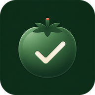

<p align="center">
  
</p>

<h1 align="center">Tomatotodo</h1>

<p align="center">
  一款融合番茄计时、任务管理与专注数据分析的桌面效率应用。
</p>

<p align="center">
  <strong>开源 · Material Design 3 · Material You · React · Vite · WebView2</strong>
</p>

## 项目简介

Tomatotodo 希望把“计划任务、开始专注、回顾时间”放在同一个安静、清晰的工作空间中。

应用采用 Google Material Design 3 设计语言与 Material You 动态配色，提供可自由编排的仪表盘、任务清单预设、多种计时方式、专注档案和轻量实用工具。Windows 版本使用原生 WebView2 外壳，不捆绑 Electron、Node.js 或完整浏览器运行库。

Tomatotodo 是一个开源项目。源代码完整保存在本仓库中，欢迎查看实现、提出建议、报告问题或参与改进。

当前版本：**1.2.0**

## 使用指南

### 认识工作区

应用左侧导航栏提供六个主要页面：

| 页面 | 用途 |
| --- | --- |
| 仪表盘 | 查看计时、任务、日期、天气、媒体等组件并开始专注 |
| 配置 | 创建、编辑、删除和排序任务清单预设 |
| 个性化 | 调整主题模式、Material You 配色、纯黑模式和字体大小 |
| 常规 | 设置计时节奏、窗口模式、圆表、倒数日、媒体与用户数据 |
| 档案 | 查看专注日历、日志、统计图和年度热力图 |
| 工具 | 使用快捷便笺、翻译、计算器和秒表 |

点击当前页面的左上角标题，或再次点击左侧对应导航按钮，可以回到页面顶部。最下方菜单按钮可收起或展开导航文字。

### 开始第一次专注

1. 在仪表盘“今日任务”中选择准备处理的任务。
2. 在“计划时段”中选择专注或短休。
3. 点击右下角播放按钮开始计时。
4. 计时过程中再次点击可以暂停，旁边的方形按钮用于重置。
5. 完成一轮专注后，应用会记录专注日志并获得一枚番茄。

启用短休后，专注与短休会自动轮换。开始、暂停和完成状态会通过应用顶部消息提示；在系统允许时也可显示系统通知。

### 正向计时、沉浸模式与小窗

- **正向计时**：从 `00:00` 开始累计，适合临时学习或碎片时间，停止后同样计入档案。
- **沉浸模式**：进入全屏翻页时钟，顶部灵动岛显示专注、短休或暂停状态。
- **小窗模式**：显示置顶计时小窗，可查看当前状态并直接暂停或继续。

这些功能既可以从仪表盘组件开启，也可以在“常规”页面调整。

### 管理任务清单

1. 打开“配置”页面。
2. 点击右下角“添加预设”创建新清单。
3. 填写清单名称，并按需添加任务名称、小标题和预计番茄数。
4. 拖拽任务条目可以调整顺序，点击保存完成创建。
5. 清单卡片右上角菜单可用于编辑或删除清单。

仪表盘会显示当前清单名称、任务完成情况及已设置的预计番茄数。点击任务可将其设为当前任务；右侧完成按钮用于切换完成状态。

### 编辑仪表盘

1. 点击仪表盘右上角编辑按钮。
2. 长按并拖动组件调整位置。
3. 关闭暂时不需要的组件，或从右侧组件库重新添加。
4. 点击保存按钮记录本次布局。

组件按照标准网格自动对齐。窗口过小时会保留内容安全尺寸并允许滚动，避免任务文字和操作按钮被压缩隐藏。

### 查看专注档案

档案页面包含：

- 今日专注时间、完成番茄、任务进度和专注次数。
- 可切换月份的专注日历，以及每天的详细专注日志。
- 日度、周度、月度和年度统计折线图。
- GitHub 风格年度专注热力图。

点击日历日期可以查看当日日志。右上角导出按钮会生成固定比例的专注明信片，内容包括今日摘要、专注日志、日期、Logo 和品牌水印。

### 调整个性化设置

- 主题模式支持自动、日间和夜间。
- 自动模式会根据当地日出与日落切换。
- 主题色采用 Material You 配色算法，支持预设颜色和自定义种子颜色。
- 纯黑模式适合 OLED 屏幕。
- 字体缩放用于统一调整应用文字大小。

Windows 应用的原生标题栏会跟随软件内日间或夜间模式切换。

### 使用快捷便笺和工具

- 便笺输入后自动保存，窗口可以拖动并自由叠放。
- 在便笺列表中长按删除操作 2 秒即可删除便笺。
- 翻译、计算器和秒表窗口均可拖动；点击窗口会将其置于最上层。
- 秒表支持开始、停止、分段记录和清除。

首次启动会自动创建一篇可删除的使用说明便笺。恢复出厂数据后，说明便笺会重新生成。

### 使用 Spotify 或本地音乐

- **Spotify**：在“常规 → 音乐设置”填写 Spotify Developer Client ID，并确保回调地址与开发者后台完全一致。
- **本地音乐**：选择音乐文件夹后，可使用上一首、下一首、播放暂停、进度、音量、静音和播放模式控制。

本地音乐文件只在当前设备读取，不会上传。重新授权文件夹时，系统可能要求再次确认读取权限。

### 备份、导入与恢复

在“常规 → 用户数据导入与导出”中可以生成 JSON 备份。备份包含仪表盘布局、任务清单、个性化设置、常规设置、便笺和专注档案。

出于隐私与兼容性考虑，Spotify 登录令牌、本地音乐文件、文件夹授权、当前计时进度和临时窗口状态不会进入备份。

“恢复出厂数据”需要两次确认。执行后会清除专注档案、用户便笺、媒体授权与缓存，并恢复本版本保存的默认任务和设置模板。

## 主要功能

### 可编辑仪表盘

- 按标准网格添加、关闭和拖拽组件。
- 点击保存后记录组件顺序、显示状态和自定义布局。
- 包含大计时器、任务清单、当前任务、日历、天气、日期时间、倒数日、圆表、媒体、名言警句等组件。
- 响应式安全边界保证窗口缩放时文字和控件保持完整。

### 专注计时

- 专注与短休计时，可按设置自动轮换。
- 正向计时适合碎片时间记录，并正常计入专注档案。
- 沉浸模式提供全屏翻页时钟与状态提示。
- 小窗模式可在其他窗口上方显示状态、倒计时和暂停控制。
- 完成一轮专注会获得番茄，并记录任务、时间与时长。

### 任务清单

- 创建、编辑、删除和排序多套任务清单预设。
- 任务支持小标题、预计番茄数和完成状态。
- 支持长按拖拽调整任务顺序。
- 可选择当前任务，并按预计番茄数连续执行专注轮次。

### 专注档案

- 查看今日专注时间、完成番茄、任务进度和专注次数。
- 专注日历支持查看每天的专注时间与番茄数量。
- 提供日度、周度、月度和年度专注统计折线图。
- GitHub 风格年度专注热力图。
- 单日专注日志记录时间、任务与持续时长。
- 一键导出固定比例的专注明信片 PNG，包含今日摘要、日志、日期、Logo 与水印。

### Material You 个性化

- 自动、日间和夜间主题模式。
- 多套 Material You 主题色预设及自定义种子颜色。
- 支持纯黑模式、字体缩放和多种配色方案。
- Windows 原生标题栏跟随应用内日夜模式切换。

### 工具与媒体

- 自动保存、可拖拽的快捷便笺。
- 翻译、基础计算器和支持分段记录的秒表。
- Spotify 当前媒体展示。
- 本地音乐文件夹导入、播放进度、音量、静音与播放顺序控制。
- 实时天气、倒数日与可配置圆表。

### 数据管理

- 任务、设置、便笺和专注档案默认保存在本机。
- 支持导入或导出版本化 JSON 用户数据备份。
- Spotify 登录令牌、本地音乐文件和文件夹授权不会写入备份。
- 恢复出厂数据采用两次确认，并恢复保存的 1.2 默认配置模板。

## 安装 Windows 版本

### 系统要求

- Windows 10 或 Windows 11，x64。
- Microsoft Edge WebView2 Runtime。多数现代 Windows 系统已预装。
- 建议使用 1920 × 1080 或更高分辨率。

### 安装步骤

1. 从 GitHub Releases 下载 `Tomatotodo-Setup-1.2.0.exe`。
2. 运行安装程序并确认安装。
3. 安装程序会在当前用户目录安装应用，并创建桌面与开始菜单快捷方式。
4. 升级安装会保留现有任务、设置、便笺和专注记录。

> 如果安装包尚未进行代码签名，Windows SmartScreen 可能显示安全提示。请确认文件来自本仓库的正式 Release。

## 快捷键

| 快捷键 | 功能 |
| --- | --- |
| `F12` | 进入或退出无边框全屏 |
| `F5` | 刷新天气数据，不重新加载应用 |
| `Esc` | 关闭当前便笺或工具窗口 |

## 本地开发

项目使用 **pnpm** 管理依赖。

```bash
pnpm install --frozen-lockfile
pnpm dev
```

Vite 开发服务器默认运行在 `http://localhost:5173/`。

### 构建与测试

```bash
pnpm run build
pnpm run test:sites
```

也可以一次执行完整检查：

```bash
pnpm run check
```

前端构建结果位于 `dist/client/`。

## 构建 Windows 安装包

Windows 打包需要 Windows、.NET Framework 4.8 编译环境及 WebView2 Runtime。首次构建会从 NuGet 下载 WebView2 SDK。

```powershell
pnpm run build
powershell -ExecutionPolicy Bypass -File packaging/windows/build.ps1 -Setup
```

输出文件：

```text
packaging/windows/build/Tomatotodo/Tomatotodo.exe
packaging/windows/build/Tomatotodo-Setup-1.2.0.exe
```

Windows 外壳支持 Per-Monitor V2 DPI、100% WebView 基础缩放、应用主题标题栏以及 F12 无边框全屏。

## 项目结构

```text
src/                         React 页面、状态与组件样式
src/components/              玻璃与工具窗口组件
public/                      PWA 清单、离线缓存与应用图标
packaging/windows/           WebView2 原生外壳与安装程序源码
scripts/                     构建准备脚本
tests/                       自动化测试
worker/                      Web Worker / Sites 入口
dist/client/                 前端构建产物（不提交 Git）
```

## 技术栈

- React 19
- Vite 6
- Material Color Utilities
- Phosphor Icons
- Microsoft Edge WebView2
- .NET Framework WinForms Windows 外壳

## 数据与隐私

- 应用数据默认保存在浏览器本地存储或 Windows WebView2 本地配置目录。
- 本地音乐仅在当前设备读取，不会上传到 Tomatotodo 服务器。
- 启用天气、在线名言或 Spotify 功能时，应用会向相应第三方服务发送必要请求。
- Windows 卸载程序会清理本地应用数据；请在卸载前导出 JSON 备份。

## 1.2.0 更新日志

- 全面升级为 Material Design 3 界面与固定左侧导航。
- 新增可添加、关闭、拖拽和保存的组件化仪表盘。
- 重构任务清单配置，支持小标题、预计番茄数与预设排序。
- 重构专注档案，新增统计图、热力图和专注明信片导出。
- 新增沉浸翻页时钟、圆表、秒表与本地音乐控制。
- 完善 Material You 配色、日夜模式、数据备份和响应式布局。
- Windows 版本改善 DPI 清晰度，并让原生标题栏跟随应用主题。

## 开源说明

Tomatotodo 以开源方式开发和发布。你可以阅读源码、Fork 仓库、提交 Issue，并通过 Pull Request 参与功能开发、错误修复、设计优化或文档完善。

README 用于介绍项目，不替代正式开源许可证。公开发布仓库时，请同时加入明确的 `LICENSE` 文件，以说明代码的使用、修改和分发条件。

## 参与开发

欢迎通过 Issue 报告问题或提出建议。提交 Pull Request 前，请先运行：

```bash
pnpm run check
```

## 致谢

感谢 React、Vite、Material Design、Material Color Utilities、Phosphor Icons 与 Microsoft WebView2 等项目提供的优秀工具与设计基础。

---

<p align="center">把今天安排清楚，也把每一段专注看得见。</p>
