<p align="center">
  
</p>

<h1 align="center">Tomatotodo</h1>

<p align="center">安排任务，保持专注，看见每一段投入的时间。</p>

<p align="center"><strong>番茄计时 · 任务清单 · 专注档案 · 课程表</strong><br />Windows / Android 手机与平板</p>

<p align="center">
  <a href="https://github.com/GreentailTohru-arch/Tomatotodo/releases">下载安装</a> ·
  <a href="#主要功能">功能介绍</a> ·
  <a href="#快速开始">快速开始</a> ·
  <a href="#图文使用指南">图文使用指南</a> ·
  <a href="https://github.com/GreentailTohru-arch/Tomatotodo/issues">反馈问题</a>
</p>

## 官网

**[打开 Tomatotodo 官网](https://greentailtohru-arch.github.io/Tomatotodo/)**，查看实机界面、交互使用指南与安装包下载。官网源码位于 [`Website/`](./Website/)，查看 [预览与部署说明](./Website/README.md)。

## 项目简介

Tomatotodo 将计时、任务与专注记录放在同一个工作空间，适合学习、自习和日常工作。你可以选择当前任务开始专注，也可以通过日历、日志、统计图和热力图回顾自己的投入。

**Windows 桌面版采用原生 WinUI 3；Android 移动版采用 Flutter 与 Google Material Design 3。** 两个平台拥有各自的界面布局与版本号，下载时请按设备选择安装包。

## 下载与安装

| 平台 | 当前公开版本 | 系统要求 | 下载 |
| --- | --- | --- | --- |
| Windows 桌面版 | **1.6.2** | Windows 10 2004 或更新版本 / Windows 11，x64 | [Windows 安装包](https://github.com/GreentailTohru-arch/Tomatotodo/releases/download/v1.6.2/Tomatotodo-Setup-1.6.2.exe) · [更新说明](https://github.com/GreentailTohru-arch/Tomatotodo/releases/tag/v1.6.2) |
| Android 移动版 | **1.0.3** | Android 7.0 或更新版本，手机 / 平板 | [Android APK](https://github.com/GreentailTohru-arch/Tomatotodo/releases/download/android-v1.0.3/Tomatotodo-1.0.3.apk) · [更新说明](https://github.com/GreentailTohru-arch/Tomatotodo/releases/tag/android-v1.0.3) |

[查看全部版本与历史更新](https://github.com/GreentailTohru-arch/Tomatotodo/releases)

### Windows

1. 下载 `Tomatotodo-Setup-1.6.2.exe`。
2. 按安装向导选择安装位置并完成安装。
3. 从开始菜单或桌面快捷方式打开应用。

升级前建议导出用户数据备份。系统安全提示出现时，请核对下载来源及 Release 页面提供的文件校验值。

### Android

1. 下载 `Tomatotodo-1.0.3.apk`。
2. 按 Android 提示允许当前浏览器或文件管理器安装应用。
3. 安装后打开 Tomatotodo，按需授权通知和添加桌面小组件。

APK 支持 arm64-v8a、armeabi-v7a 和 x86_64，大小约 **63.4 MiB**。1.0.3 沿用 1.0.2 的签名，可覆盖升级；当前安装包使用工程调试证书签署。详细校验值见对应 Release。

> 普通用户请下载安装程序或 APK。当前客户端源码分别位于 [`windows/`](./windows/) 和 [`android/`](./android/)；历史 Release 标签仍指向当时的仓库内容，不会随本次源码上传改变。

## 主要功能

### 专注计时

- 可配置专注与短休时长，按自己的节奏安排休息。
- 支持启用或关闭短休，以及手动、自动循环计时。
- 正向计时从零累计，适合不预设结束时间的专注。
- 专注结束获得番茄，专注记录汇入档案。
- 提供计时提醒与音效设置；实际通知显示受系统权限和设置影响。

### 任务与清单

- 管理多套任务清单，并选择当前清单、当前任务。
- 任务支持标题、副标题、预计番茄数与完成状态。
- 调整任务顺序，结合计时器执行计划。
- 通过仪表盘查看当前任务与完成进度。

### 可编辑仪表盘

将计时器、清单、课程、日历、倒数日等信息组织成自己的工作台。

- 组件支持添加、移除和调整位置。
- Android 支持在编辑模式调整部分卡片尺寸。
- 手机与平板分别适配可用空间，平板提供更丰富的组件尺寸。
- 不同平台的组件范围与操作方式以当前版本为准。

### 专注档案

- 今日专注时间、完成番茄、任务进度和专注次数。
- 专注日历与按日期查看的详细日志。
- 日度、周度、月度和年度统计。
- 年度专注热力图，帮助观察长期习惯。
- 专注摘要导出与分享。

### 课程表

- 按周查看课程与课程详情。
- 仪表盘展示今日课程、接下来课程。
- 课程提醒与课程表 JSON 导入、导出。
- Android 支持课程搜索与周次切换，平板采用多列布局。

### 外观与语言

- 浅色、深色与自动主题，支持主题色个性化。
- Android 采用 Material You 配色与 MD3 控件，适配手机和平板。
- Windows 采用 WinUI 界面，并提供系统托盘、小窗等桌面交互。
- 提供 **41 个语言／地区选项**与“跟随系统”；不支持的系统语言回退英文。
- 阿拉伯语、希伯来语适配从右到左的布局。

翻译资源仍在持续完善，尚未全部完成母语人工校对。欢迎反馈不自然的译文、文本溢出或布局问题。

## 平台特色

| Windows 桌面版 | Android 移动版 |
| --- | --- |
| 原生 WinUI 3 界面 | Flutter + Material Design 3 |
| 系统托盘与快捷计时操作 | 手机、平板及横竖屏适配 |
| 可拖动的计时小窗与屏幕边缘吸附 | 可调整尺寸的仪表盘组件 |
| 开机启动与关闭窗口行为设置 | 系统桌面小组件 |
| 单实例运行与桌面窗口交互 | 通知音效、震动与系统通知设置 |

Android 桌面小组件包含专注计时、任务清单、今日课程、倒数日和名言警句等类型。支持尺寸因组件而异，可通过启动器添加和调整；启动器的网格与缩放规则也会影响显示效果。

## 快速开始

1. **配置任务**：创建清单，添加任务，按需填写副标题与预计番茄数。
2. **选择当前任务**：回到仪表盘，选择准备处理的事项。
3. **设置节奏**：在“常规 → 通用设置”调整专注时长、短休和循环方式。
4. **开始专注**：使用开始／暂停按钮控制计时。
5. **回顾记录**：在“档案”中查看当天日志和长期统计。

自动循环会按设置衔接阶段；手动循环在阶段结束后等待开始。正向计时不自动结束，也不自动奖励番茄。

## 图文使用指南

第一次使用时，建议按 **配置清单 → 选择任务 → 设置节奏 → 开始专注 → 查看档案** 的顺序操作。

下面的 Windows 图片来自 **1.6.2 已安装客户端**；Android 图片来自 **1.0.3 手机和平板模拟器中的实际运行界面**。截图摄于 2026 年 10 月 3 日，画面中的任务、课程、时间和统计是捕获时的数据示例，不代表初次安装时的默认内容。软件截图没有使用 AI 重绘。

### 页面导航速查

| 页面 | 用途 | 什么时候打开 |
| --- | --- | --- |
| 仪表盘 | 控制计时，查看当前任务与日常信息 | 准备开始专注、暂停或整理组件时 |
| 配置 | 创建清单、编辑任务与安排顺序 | 制订计划、调整任务或管理清单时 |
| 档案 | 查看专注日历、日志、统计与热力图 | 回顾一天的投入或观察长期习惯时 |
| 课程表 | 按周查看课程安排 | 确认课程时间、教室和教师时 |
| 工具（Windows） | 打开便笺、计算器、时钟与翻译 | 专注过程中需要处理临时小事时 |
| 常规 | 管理计时、外观、账户、数据与更新 | 调整使用习惯、备份数据或检查更新时 |

### 1. 仪表盘：选择任务，开始专注

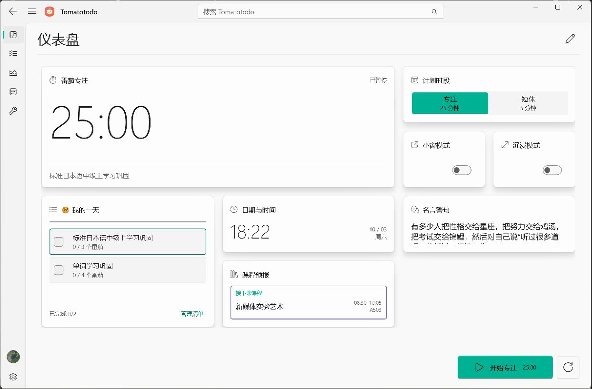

仪表盘是日常使用的主工作台。计时器显示当前阶段和时间；清单组件帮助你选择本次专注的任务；课程、日历、倒数日等组件提供日常信息。

1. 在清单组件中选择当前任务，再开始计时，让记录有明确归属。
2. 用右下角的按钮开始、暂停或重置计时；通过计划时段查看专注和短休时长。
3. 点击右上角编辑按钮，添加、移除或移动组件，完成后保存布局。
4. Windows 可按需要启用小窗或沉浸模式；Android 可在编辑模式长按可调整组件的右下角，拉伸到支持的尺寸。平板提供部分更大的组件尺寸。

> 想从零累计时间？在常规中启用正向计时。它不会自动结束，也不会自动奖励番茄。

### 2. 配置：把计划整理成清单

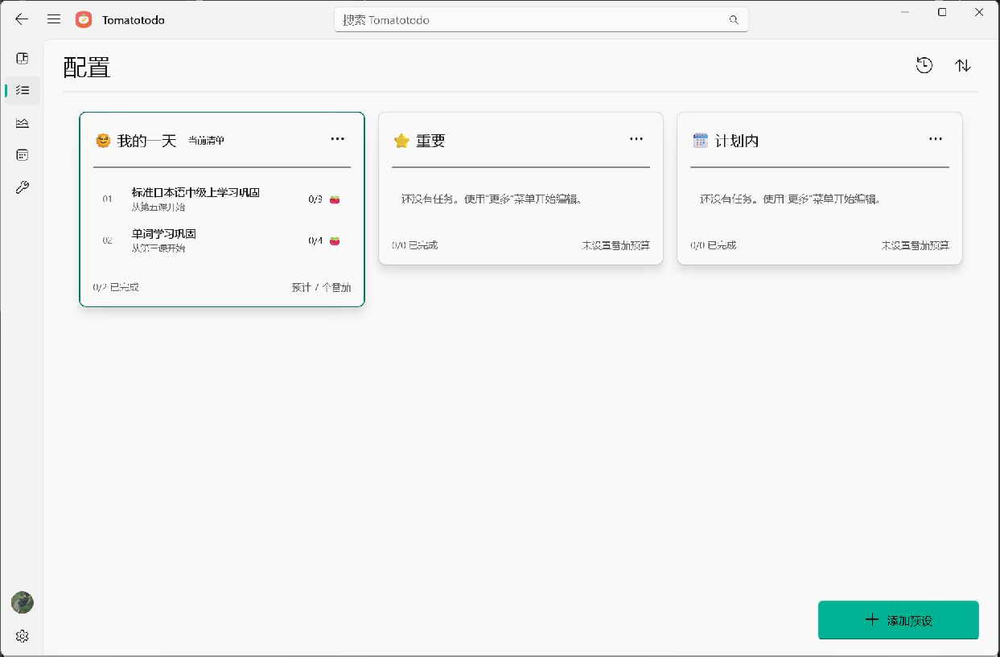

配置用于管理多套任务清单，例如学习、工作或某个项目。清单里的任务可填写主标题、副标题和预计番茄数。

1. 新建或编辑一份清单，为它取一个容易识别的名字。
2. 添加任务；把需要补充的信息放在副标题中，按需要设置预计番茄数。
3. 调整任务顺序，并将准备使用的清单设为当前清单。
4. 回到仪表盘选中任务并计时；完成事项后勾选，查看清单完成进度。

Android 中，清单任务可展开或收起；编辑任务时可滑动条目露出编辑、删除等动作。历史任务恢复时可选择目标清单。

### 3. 档案：回顾每一段投入

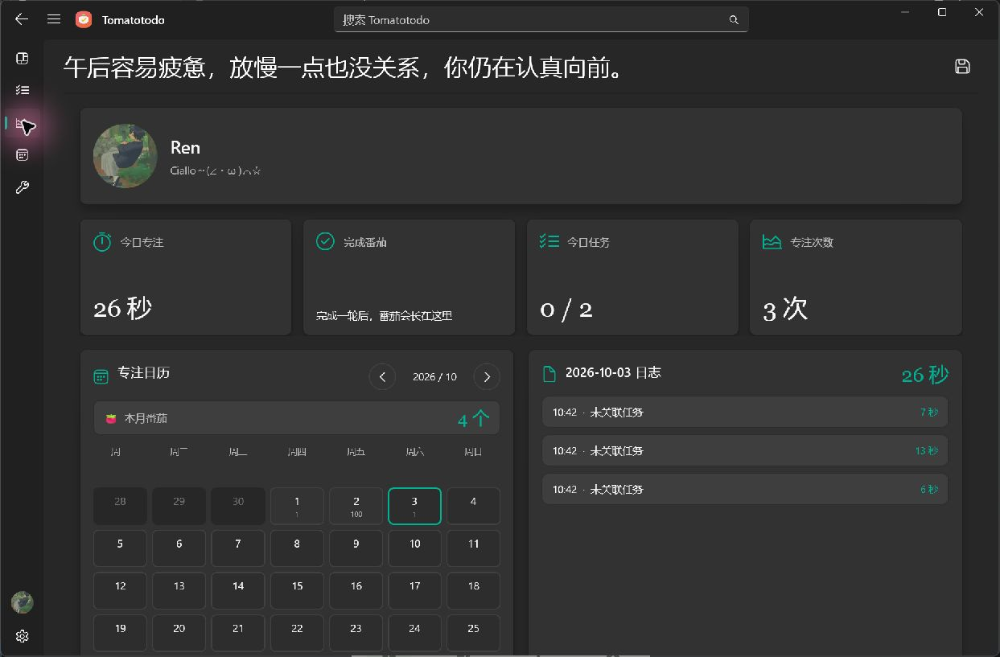

档案将专注记录整理成日历、日志、统计图和热力图。顶部汇总用于快速查看当天投入，下面的卡片用于进一步回顾。

1. 在专注日历中选择日期，查看对应日期的日志。
2. 在日志中查看具体任务、记录时间与专注时长；记录较多时在卡片内滚动。
3. 切换日度、周度、月度、年度统计，并用前后按钮查看其他时间段。
4. 用年度热力图观察长期习惯；Windows 可悬停查看具体时长。
5. 使用顶部导出／分享入口生成专注摘要。

> 专注时间和完成番茄是不同指标：一次专注累计了时间，不代表一定已经完成一个番茄。

### 4. 课程表：确认本周安排

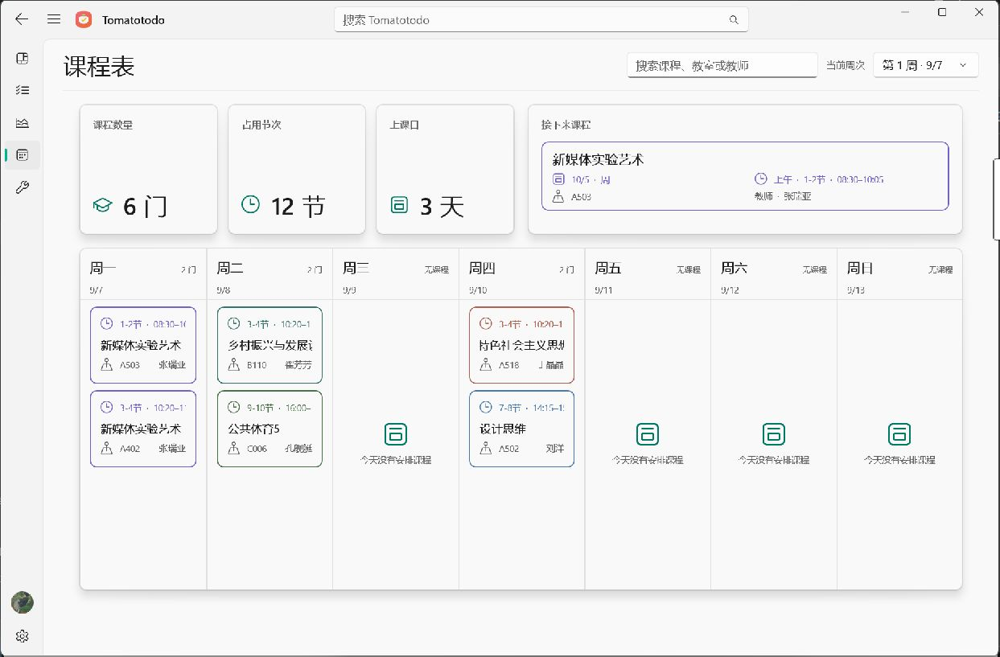

课程表用于按周查看课程，颜色帮助区分不同课程。课程数据也供仪表盘的今日课程、接下来课程组件以及课程提醒使用。

1. 在常规中的课程表导入与导出功能导入课程 JSON。
2. 查看本周安排，并切换周次确认其他周的课程。
3. 阅读课程名称、上课时间、教室和教师信息。
4. Android 可使用右上角搜索按钮查找课程。
5. 需要提前提醒时，在常规中设置课程提醒和提前时间。

Android 隐藏课程表导航入口后，仪表盘与系统桌面小组件仍可显示课程。

### 5. 工具：随手处理临时小事（Windows）

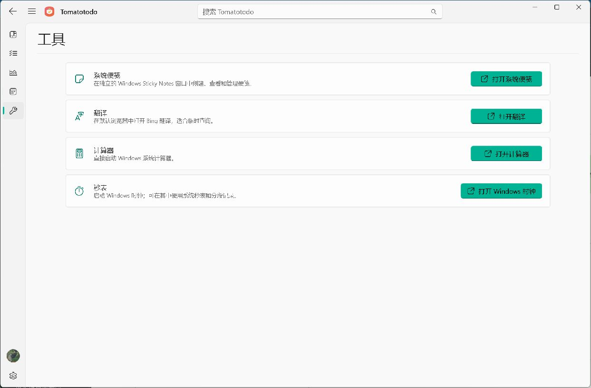

工具页把常用入口集中到一起，便于在专注过程中快速打开：

- **便笺**：打开 Windows 系统便笺，记录临时想法。
- **计算器**：打开系统计算器，处理计算。
- **秒表**：打开 Windows 时钟中的相关计时功能。
- **翻译**：在默认浏览器中打开 Bing 翻译。

这些入口调用系统应用或外部服务；翻译需要网络，系统工具需要本机已安装对应应用。

### 6. 常规：调整节奏、外观与数据

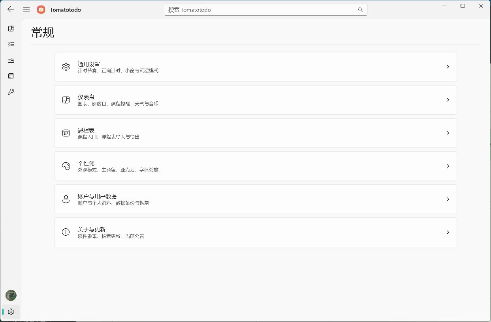

常规用于设置软件行为。Android 使用分组与二级菜单；平板在宽屏下使用左右分栏，便于保留分类导航。

| 设置方向 | 可以做什么 |
| --- | --- |
| 通用设置 | 选择语言、调整计时节奏、启用短休、选择手动／自动循环或正向计时；Android 还提供通知音效、震动和桌面小组件相关入口 |
| 仪表盘 | 调整进度指示器、圆表、倒数日及课程提醒等选项 |
| 课程表 | 管理课程表入口与课程数据导入、导出 |
| 个性化 | 切换浅色、深色、自动模式，选择主题色与显示选项 |
| 账户与用户数据 | 登录云端账户、迁移或上传数据、导入／导出备份 |
| 关于与更新 | 查看版本、检查更新、阅读公告与软件介绍 |

具体分组和可用选项因平台而异。修改计时时长后，请按软件提示重置计时器；覆盖、迁移或恢复出厂数据之前，先导出备份。

### Android：手机与平板的使用方式

<p align="center">
  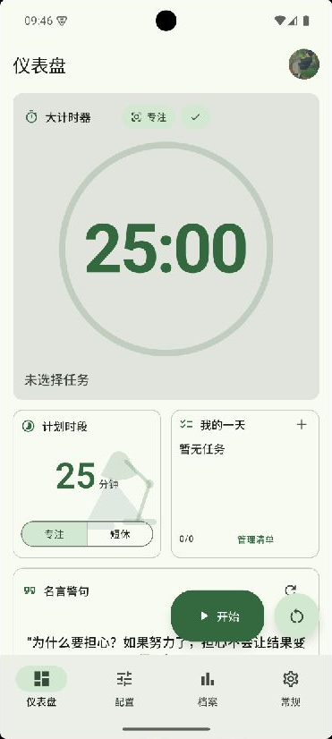
  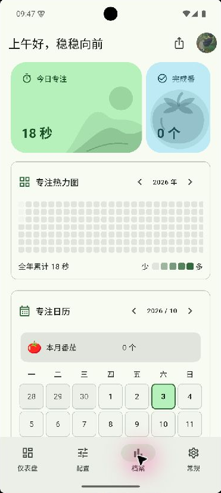
</p>

**手机**通过底部导航切换仪表盘、配置、课表、档案和常规；课表入口是否显示取决于设置。创建清单、选择任务、计时和查看记录的基本流程与桌面版相同。

**系统桌面小组件**可从手机启动器的小组件入口添加。专注组件可开始／暂停计时；清单组件可查看和勾选任务；还有课程、倒数日和名言警句等类型。不同启动器的入口和支持尺寸可能不同。

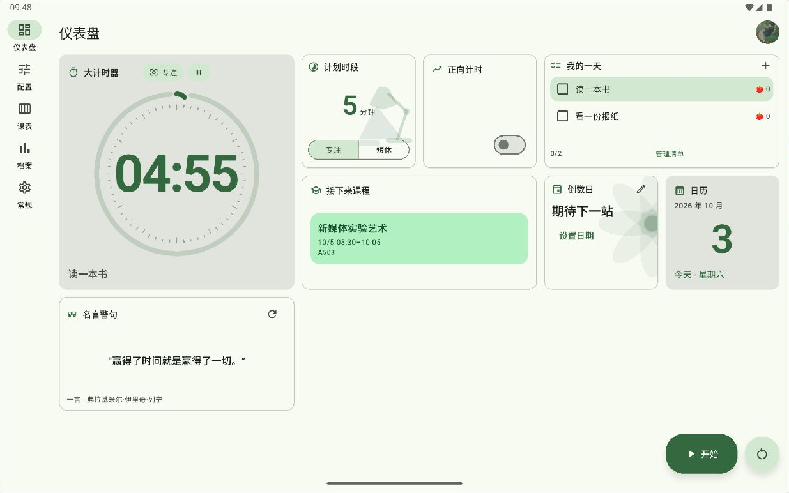

**平板**在大屏下使用侧边导航与多列卡片。仪表盘可利用额外空间显示较大的计时器和更多信息；调整布局时，长按移动组件，或拉伸支持调整尺寸的组件。

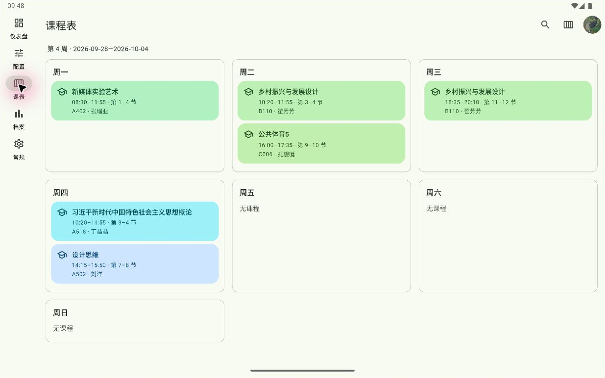

平板课程表采用多列布局。同一排课程容器保持相同高度，课程较多时可在容器内滚动查看。

### 外观预览：浅色与深色

| 浅色模式 | 深色模式 |
| --- | --- |
|  | 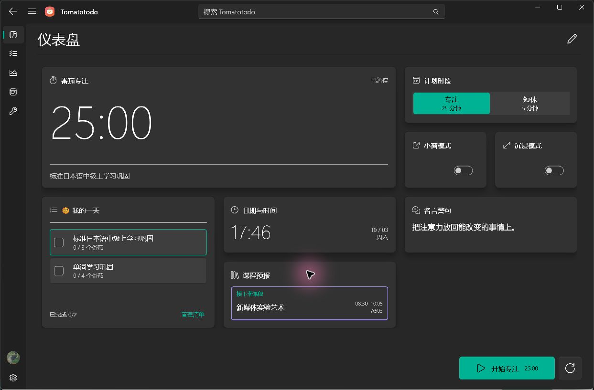 |

在个性化中选择外观与主题色。Android 可选择跟随系统主题色；自动模式的解析方式以对应客户端的设置说明为准。

[到官网交互查看页面指南与实机截图](https://greentailtohru-arch.github.io/Tomatotodo/#desktop-guide) · [下载对应平台版本](#下载与安装)

## 账户、同步与数据备份

应用提供本地使用方式，也提供云端账户入口。云端账户支持注册、登录，以及本地与云端数据迁移、手动上传等操作；具体注册条件以应用内提示为准。

- 云端使用涉及用户数据上传，请确认当前账户与同步提示。
- 手机与电脑的界面布局不同，不要将某个平台的布局视为另一平台的直接复制。
- 在覆盖、迁移、恢复出厂数据或卸载前，建议先导出 JSON 备份。
- 课程表可使用独立的 JSON 导入、导出功能。

使用多个设备时，请关注同步状态和数据选择提示，避免在未确认同步完成时反复覆盖数据。

## 更新与公告

在“常规”中可查看版本、检查更新与当前公告。Android 的入口位于“关于与更新”。

启动时可检查新版本；跳过某个版本后，仍可通过手动检查更新重新查看。更新内容、系统要求和安装文件以对应平台的 Release 为准。

### 近期更新

**Windows 1.6.2**

- 手动／自动循环计时与阶段结束提醒。
- 计时小窗屏幕边缘吸附、多显示器工作区域适配。
- 单实例运行、主题切换修复与托盘图标设置。
- 41 个语言／地区选项。

**Android 1.0.3**

- 启用短休、手动／自动循环与正向计时设置。
- 41 个语言／地区选项及 RTL 适配。
- 修复长译文溢出、底部导航错位与边距问题。
- 优化状态胶囊、档案汇总和日历的语言适配。
- 关于页面接入云端配置的开发者、特别鸣谢、赞助者与赞助链接。

完整改动与已知说明见各平台的 Release 页面。

## 数据与隐私

- 本地使用与云端账户使用的数据流不同；启用云端同步后，相关数据会传输至云端服务。
- 在线功能需要网络，请结合系统权限与应用设置决定是否启用。
- JSON 备份用于数据迁移，请妥善保存，避免公开分享包含个人任务或日志的文件。
- 卸载应用或清除应用数据前，请完成备份，不要依赖卸载后的本地记录仍然保留。

## 仓库与源码说明

当前 Windows 和 Android 客户端的源码分别管理：

| 目录 | 版本 | 技术栈 | 编译说明 |
| --- | --- | --- | --- |
| [`windows/`](./windows/) | 1.6.2 | C# / .NET 10 / WinUI 3 | [Windows 开发文档](./windows/README.md) |
| [`android/`](./android/) | 1.0.3+9 | Flutter / Dart / Android Kotlin | [Android 开发文档](./android/README.md) |

两个客户端包含各自的数据模型、同步客户端、界面和测试。云端服务端不包含在这两个目录中；云端功能需要可用的服务。仓库不包含本地账户数据、认证令牌、签名私钥、已编译安装包或 SDK 缓存。

### Windows 开发

安装 .NET 10 SDK、Windows SDK 及 WinUI 开发工具后，在 Visual Studio 打开 `windows/Tomatotodo.Windows.slnx`。命令行构建：

```powershell
cd windows
dotnet restore Tomatotodo.Windows.csproj
dotnet build Tomatotodo.Windows.csproj -p:Platform=x64
```

安装程序使用 Inno Setup 6 构建，具体参数见 Windows 开发文档。

### Android 开发

安装满足 `pubspec.yaml` 中 Dart SDK 约束的 Flutter SDK，以及 Android SDK / Java 17。Android Studio 打开 `android/` 目录：

```bash
cd android
flutter pub get
flutter analyze
flutter test
flutter build apk --release
```

源码保留 iOS 和 Web 平台脚手架；不代表已发布或完成验证的 iOS 产品。Android 当前 release 构建使用调试签名，正式分发应自行配置签名，私钥不得提交。

### 目录结构

```text
README.md       软件介绍与下载入口
icon.png        当前软件图标
windows/        Windows 1.6.2 原生客户端源码
android/        Android 1.0.3 Flutter 客户端源码
Website/        官网源码、实机截图与交互指南
Tomatotodo-1.3.0-… .pdf  保留的两份历史鉴别材料
```

## 反馈与参与

欢迎通过 [Issues](https://github.com/GreentailTohru-arch/Tomatotodo/issues) 提交问题和建议。为了便于复现，请附上：

- 平台、软件版本与系统版本。
- 操作步骤、预期结果与实际结果。
- 截图或日志；请先遮挡账户、邮箱等个人信息。
- 语言问题请注明所选语言，布局问题请注明设备尺寸与横竖屏状态。

修改 Android 工程请运行 `flutter analyze` 和 `flutter test`；Windows 请完成构建并运行相关测试项目。

## 开源许可证

本项目采用 [MIT License](LICENSE)。第三方依赖及素材遵循各自的许可证。

## 致谢

感谢 Flutter、WinUI、React、Vite、Material Design、Material Color Utilities 及相关工具与社区的支持。

---

<p align="center">把今天安排清楚，也把每一段专注看得见。</p>
